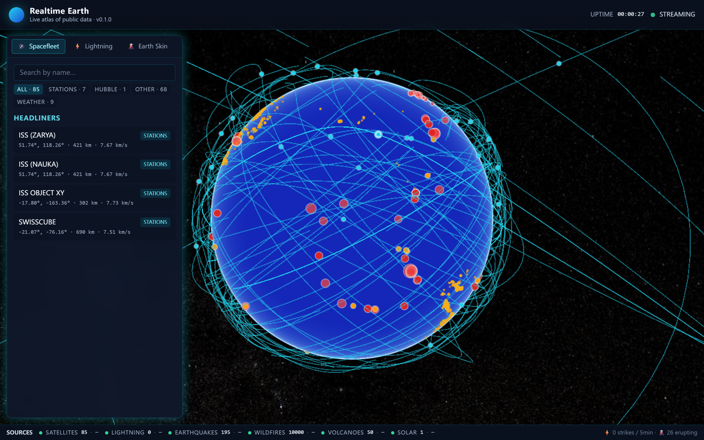
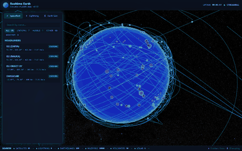

# 🌍 Realtime Earth

> **A single 3D globe that aggregates the world's public real-time data streams — satellites, lightning, earthquakes, wildfires, volcanoes, and solar activity — all on one live canvas.**

[](https://www.python.org/)
[](https://vuejs.org/)
[](https://cesium.com/)
[](https://fastapi.tiangolo.com/)
[](LICENSE)
[](#-quick-start)
[](#-quick-start)
[](https://github.com/miaochengy-pngu/realtime-earth/stargazers)

<p align="center">
  <table>
    <tr>
      <th align="center">📷 Static screenshot</th>
      <th align="center">🎬 8-second live capture</th>
    </tr>
    <tr>
      <td align="center"><a href="docs/preview.png"></a></td>
      <td align="center"><a href="docs/preview.mp4"></a></td>
    </tr>
    <tr>
      <td align="center"><sub>2560×1600 · 924 KB</sub></td>
      <td align="center"><sub>480×300 · 1.5 MB · <a href="docs/preview.mp4">MP4 (572 KB)</a></sub></td>
    </tr>
  </table>
</p>
<p align="center"><sub>👆 GIF is a recording, not interactive — but the <b>live app</b> at <code>localhost:8000</code> is real CesiumJS: drag to rotate, scroll to zoom, click any satellite ⚡</sub></p>

---

## 🎬 What it looks like

A single CesiumJS globe. Flip layers on. Watch the planet breathe.

- 🛰️ **80+ satellites** orbit in real time — ISS, Tiangong (天宫), Hubble, James Webb, Starlink constellation
- ⚡ **Lightning strikes** pop in at 1-second granularity with positive / negative polarity
- 🔥 **Wildfires** from NASA's thermal anomaly feed (VIIRS / MODIS), refreshed every 30 minutes
- 🌋 **Volcanoes** from the Smithsonian GVP weekly bulletin — current activity level
- 💢 **Earthquakes** from USGS M0+, with depth, "felt" reports, and tsunami flag
- ☀️ **Sun & space weather** — Kp index, solar wind, sunspot number, X-ray class, aurora probability

All sources are **free, public, no API keys required**. No tracking. No login. No ads.

---

## ⚡ Quick start

> **One command. Any computer. No Docker. No database. No build step.**

### Prerequisites

- **Python 3.11+** — [download here](https://www.python.org/downloads/)
  - On Windows: **check ✅ "Add Python to PATH"** in the installer
  - On macOS: `brew install python@3.12`  •  On Linux: `sudo apt install python3.12 python3.12-venv`
- **~500 MB free disk** (for the venv + cached data)
- **Internet access** (for the initial `pip install` and for live data feeds)

### Run it

#### Windows — just double-click

```
Double-click  start.bat
```

Or from PowerShell / CMD:
```powershell
python start.py
```

#### macOS / Linux

```bash
chmod +x start.sh        # first time only
./start.sh
```

Or simply:
```bash
python3 start.py
```

### What `start.py` does (so you don't have to)

1. ✅ Locates a Python ≥ 3.11 on your `PATH`
2. ✅ Creates `backend/.venv` if it doesn't exist (idempotent)
3. ✅ `pip install` the backend dependencies (only on first run, ~1–2 min)
4. ✅ Copies `.env.example` → `.env` if missing
5. ✅ Kills anything else still bound to port `8000`
6. ✅ Launches `uvicorn` — **one process serves both the API and the built frontend**

When you see **`Application startup complete`**, open the browser:

| URL | What it is |
|-----|------------|
| <http://localhost:8000> | 🌍 The 3D globe |
| <http://localhost:8000/docs> | 📖 FastAPI Swagger (REST API) |
| <http://localhost:8000/healthz> | 💚 Per-source liveness status |
| <http://localhost:8000/diag.html> | 🩺 WebGL diagnostic (use this if the globe is black) |

Stop with **Ctrl+C**.

---

## 🩺 Troubleshooting

### The globe is black / not rendering

Open <http://localhost:8000/diag.html>. If it says `WebGL 2 — Software` or `WebGL unavailable`, your browser doesn't have hardware acceleration enabled:

- **Chrome / Edge** — go to `chrome://settings/system` → enable "Use graphics acceleration when available" → restart the browser
- **VS Code's built-in browser** (Code 1.x) — does **not** support WebGL workers. **Use a real Chrome / Edge / Firefox window instead.**

### Port 8000 is busy

`start.py` auto-kills the old listener. If it still fails, pick a different port:

```powershell
$env:REALTIME_EARTH_PORT=9000; python start.py     # PowerShell
REALTIME_EARTH_PORT=9000 python3 start.py          # bash / zsh
```

### `pip install` is slow or fails

Use a mirror:

```powershell
cd backend
.venv\Scripts\python.exe -m pip install -e . -i https://pypi.tuna.tsinghua.edu.cn/simple
```

```bash
# macOS / Linux
cd backend
.venv/bin/pip install -e . -i https://pypi.tuna.tsinghua.edu.cn/simple
```

### Lightning layer is empty

Blitzortung's servers are not reachable from some networks (notably parts of mainland China). **This is a network limitation, not a bug** — the source degrades gracefully, all other layers keep working.

### `numpy` fails to compile

You're on Python 3.13. Install Python 3.12 — it has pre-built wheels for everything and the install is 10× faster.

---

## 🏗 Architecture

```
              ┌──────────────────────────────────┐
              │  CelesTrak · Blitzortung ·       │
              │  NASA · USGS · NOAA · GVP        │   public APIs
              └────────────────┬─────────────────┘
                               │  poll / fetch
              ┌────────────────▼─────────────────┐
              │     Source Adapters              │   Python: BaseSource subclasses
              │     backend/app/sources/*.py     │
              └────────────────┬─────────────────┘
                               │  in-memory state + APScheduler
              ┌────────────────▼─────────────────┐
              │   FastAPI + WebSocket            │
              │   (backend/app/main.py)          │
              │   + mounts frontend/dist         │
              └────────────────┬─────────────────┘
                               │  HTTP / WS (single port 8000)
              ┌────────────────▼─────────────────┐
              │   Vue 3 + CesiumJS 1.121         │
              │   (single 3D globe, Pinia store) │
              └──────────────────────────────────┘
```

**Stack:**
- **Backend** — Python 3.11+, FastAPI, asyncio, httpx, sgp4, APScheduler, Pydantic v2
- **Frontend** — Vue 3, TypeScript, Vite, Pinia, **CesiumJS 1.121**, Tailwind, ECharts
- **Realtime** — WebSocket per source; REST for one-shot queries
- **Distribution** — single `uvicorn` process; no nginx, no Docker, no DB

See [docs/ARCHITECTURE.md](docs/ARCHITECTURE.md) for the full design.

---

## 📂 Project layout

```
realtime-earth/
├── start.py            # cross-platform launcher (the heart of the project)
├── start.bat           # Windows double-click entry
├── start.sh            # macOS / Linux entry
├── .env.example        # config template (auto-copied to .env)
│
├── backend/            # Python FastAPI backend
│   ├── app/
│   │   ├── main.py         # FastAPI entry — also mounts frontend/dist
│   │   ├── sources/        # one adapter per data source
│   │   ├── routers/        # REST endpoints
│   │   ├── models/         # Pydantic data models
│   │   └── core/           # config / scheduler / WebSocket
│   ├── tests/
│   ├── pyproject.toml      # dependency manifest
│   └── Dockerfile          # (optional, not used by start.py)
│
├── frontend/           # Vue 3 + Cesium frontend
│   ├── src/                # source
│   ├── public/             # static (incl. diag.html)
│   ├── dist/               # ✅ pre-built (12 MB, includes Cesium)
│   │                         shipped in the repo so users don't run `npm install`
│   ├── package.json
│   └── vite.config.ts
│
└── docs/               # design notes, screenshots
```

---

## 🛠 For developers: editing the frontend

The shipped `frontend/dist/` is a frozen build. If you want to modify the UI:

```bash
cd frontend
npm install           # install deps (~200 MB)
npm run dev           # dev server, http://localhost:5173, hot-reload
npm run build         # rebuild dist/
```

After `npm run build`, restart `python start.py` — the new `dist/` is picked up automatically.

To add a new data source, subclass `BaseSource` and register it in `core/scheduler.py` — see [docs/DEVELOPMENT.md](docs/DEVELOPMENT.md).

---

## 📜 Data attribution

| Source | License | Link |
|--------|---------|------|
| CelesTrak (TLE elements) | Public Domain | <https://celestrak.org/> |
| Blitzortung community lightning | Free for non-commercial use with attribution | <https://www.blitzortung.org/> |
| NASA FIRMS (fires) | Public Domain | <https://firms.modaps.eosdis.nasa.gov/> |
| USGS Earthquake Hazards | Public Domain | <https://earthquake.usgs.gov/> |
| Smithsonian GVP (volcanoes) | Free for non-commercial use with attribution | <https://volcano.si.edu/> |
| NOAA SWPC (space weather) | Public Domain | <https://www.swpc.noaa.gov/> |
| NASA SDO (solar imagery) | Public Domain | <https://sdo.gsfc.nasa.gov/> |

This project's source code is **MIT** — see [LICENSE](LICENSE).
The data layers retain their original licenses; attribution is rendered on the globe.

---

## 🎯 Why this exists

Most people know flight trackers and ISS trackers. Very few realize you can also watch **lightning in real time**, see **exactly which farms are burning in Brazil right now**, follow a **Starlink satellite's path overhead in 3D**, or notice that **the Kp index just jumped to 7 and the aurora oval is over Beijing tonight**. Realtime Earth gathers these quiet public data streams into a single, beautiful picture.

---

## 🙏 Contributing

Issues and PRs welcome. To add a new data source, panel, or color palette, see [docs/DEVELOPMENT.md](docs/DEVELOPMENT.md).

---

> **Stuck?** Open <http://localhost:8000/healthz> and <http://localhost:8000/diag.html> first — 99% of problems show up there. Then open an issue with the output of both pages.

---

---

# 🇨🇳 中文版 (Chinese)

## 🌍 Realtime Earth — 实时 3D 地球数据可视化

> **一个 3D 地球，把全球公开的实时数据流汇集到一起：卫星轨道 / 闪电 / 地震 / 野火 / 火山 / 太阳活动。**

---

### ✨ 你能看到什么

| 模块 | 内容 | 更新频率 | 数据源 |
|------|------|----------|--------|
| 🛰 **卫星** | ISS / 中国天宫 / 哈勃 / 詹姆斯·韦伯 / Starlink 等 80+ 颗在轨卫星 | 30s | CelesTrak TLE |
| ⚡ **闪电** | 全球闪电实时打点，含正/负极性 | 10s | Blitzortung 社区网络 |
| 🔥 **野火** | NASA 热异常 (VIIRS/MODIS)，亮度/辐射功率 | 30min | NASA FIRMS |
| 🌋 **火山** | Smithsonian 全球活火山活动状态 | 每周 | Smithsonian GVP |
| 💢 **地震** | 全球 M0+ 地震，含深度/海啸标志 | 1min | USGS GeoJSON |
| ☀️ **太阳** | Kp 指数、太阳风、X 射线等级、极光预测 | 1min | NOAA SWPC |

全部**免费 / 公开 / 无需 API key**。无追踪，无登录，无广告。

---

### 🚀 启动 (任何一台电脑,三步搞定)

**前置要求**

- **Python 3.11+** ([下载](https://www.python.org/downloads/))
  - Windows 安装时务必勾选 ✅ "Add Python to PATH"
  - macOS / Linux 通常自带,或用 `brew install python@3.12` / `apt install python3.12`
- 大约 **500 MB 磁盘空间** (虚拟环境 + 依赖)
- 联网 (首次安装依赖 + 拉取实时数据)

**启动方式**

#### Windows 用户 (最简单)

**双击 `start.bat`** — 完事。

或者命令行：
```powershell
python start.py
```

#### macOS / Linux 用户

```bash
chmod +x start.sh   # 首次需要赋予执行权限
./start.sh
```

或直接：
```bash
python3 start.py
```

**它做了什么 (无需手动操作)**

`start.py` 会自动：
1. ✅ 在 PATH 上找一个 Python ≥ 3.11
2. ✅ 在 `backend/.venv` 创建虚拟环境 (只在首次)
3. ✅ `pip install` 后端依赖 (只在首次,约 1-2 分钟)
4. ✅ 复制 `.env.example` 到 `.env` (如果不存在)
5. ✅ 自动释放端口 8000 (杀死残留进程)
6. ✅ 启动 uvicorn,**同一进程**同时服务 API + 前端

首次启动看到 `Application startup complete` 后,**打开浏览器**:

| 地址 | 用途 |
|------|------|
| <http://localhost:8000> | 🌍 3D 地球主界面 |
| <http://localhost:8000/docs> | FastAPI Swagger 文档 |
| <http://localhost:8000/healthz> | 各数据源健康状态 |
| <http://localhost:8000/diag.html> | WebGL 诊断 (黑屏时看这里) |

按 **Ctrl+C** 停止。

---

### 🐛 排查

**浏览器打开是黑色的地球?**

打开 <http://localhost:8000/diag.html>。如果显示 `WebGL 2 — Software` 或 `WebGL 不可用`,说明浏览器没有启用硬件加速:
- **Chrome / Edge**: 地址栏输入 `chrome://settings/system` → 打开 "可用时使用图形加速" → 重启浏览器
- **VS Code 内置浏览器** (Code 1.x): 不支持 WebGL Workers,**请用真正的 Chrome / Edge / Firefox 打开**

**端口 8000 已被占用?**

`start.py` 会自动杀死占用进程。如果还是失败,改端口:
```powershell
$env:REALTIME_EARTH_PORT=9000; python start.py    # Windows PowerShell
REALTIME_EARTH_PORT=9000 python3 start.py          # macOS / Linux
```

**依赖安装失败 (网络问题 / 编译错误)?**

- **`numpy` 编译错误**: 你装的是 Python 3.13。换 Python 3.12,wheel 都是预编译的,秒装。
- **网络慢**: 用国内镜像
  ```powershell
  cd backend
  .venv\Scripts\python.exe -m pip install -e . -i https://pypi.tuna.tsinghua.edu.cn/simple
  ```

**闪电图层是空的?**

Blitzortung 的数据服务器在中国大陆部分网络下不可达。**这是网络限制,不是 bug** — 后端会优雅降级,其他图层正常工作。

---

### 📜 数据源版权

| 数据源 | License | 链接 |
|--------|---------|------|
| CelesTrak (TLE) | Public Domain | <https://celestrak.org/> |
| Blitzortung Lightning | 非商业用途免费,需署名 | <https://www.blitzortung.org/> |
| NASA FIRMS | Public Domain | <https://firms.modaps.eosdis.nasa.gov/> |
| USGS Earthquake | Public Domain | <https://earthquake.usgs.gov/> |
| Smithsonian GVP | 非商业用途免费,需署名 | <https://volcano.si.edu/> |
| NOAA SWPC | Public Domain | <https://www.swpc.noaa.gov/> |
| NASA SDO | Public Domain | <https://sdo.gsfc.nasa.gov/> |

本项目代码采用 **MIT** 协议,见 [LICENSE](LICENSE)。

---

> **遇到问题?** 先打开 <http://localhost:8000/healthz> 和 <http://localhost:8000/diag.html>,
> 99% 的问题在这两个页面能找到答案。然后再开 Issue,贴上这两个页面的输出。
